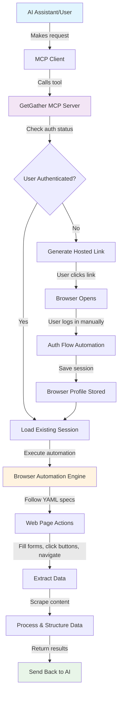

# GetGather Application Flow Diagram

## What GetGather Does

GetGather is a **Web Automation as a Service** platform that allows AI assistants to interact with websites on your behalf. Think of it as a bridge between AI models and real websites - it can shop online, book services, extract data, and perform other web tasks while keeping your login sessions secure.

## Simple Application Flow

## Key Components Explained

### 🤖 **MCP Integration**
- **What it is**: Model Context Protocol - allows AI assistants to use tools
- **How it works**: AI calls functions like `amazon_get_orders()` or `doordash_reorder_item()`
- **Why it matters**: Connects any AI assistant to real-world web services

### 🔐 **Authentication System**  
- **Hosted Links**: Temporary, secure URLs for user login (expire in 15 mins)
- **Browser Profiles**: Saves login sessions so you don't re-login every time
- **Multi-brand Support**: Separate, isolated sessions for different websites

### 🎭 **Browser Automation**
- **YAML Specifications**: Each website has a "recipe" defining how to interact with it
- **Two Modes**: 
  - **Declarative** (follow predefined steps)
  - **AI-driven** (intelligent browsing using AI agents)
- **Headless Browser**: Runs invisibly in a container with optional VNC access for debugging

### 📊 **Data Processing**
- **Extraction**: Pulls specific information from web pages
- **Bundling**: Packages raw HTML/JSON data for processing  
- **Parsing**: Converts messy web data into clean, structured information
- **Return**: Sends processed data back to the AI assistant

## Real-World Example Flow

1. **User asks AI**: "What did I order from Amazon last month?"

2. **AI calls tool**: `amazon_get_purchase_history()`

3. **GetGather checks**: Is user logged into Amazon? 
   - If No → Generates secure link: "Please log into Amazon: https://getgather.local/auth/abc123"

4. **User authenticates**: Clicks link, logs into Amazon in browser

5. **GetGather automates**: 
   - Navigates to order history page
   - Extracts order data from HTML tables
   - Converts to structured JSON

6. **AI receives data**: Clean list of orders with dates, items, prices

7. **AI responds**: "Last month you ordered: wireless headphones ($89), coffee pods ($24), and a phone case ($15)"

## Security & Isolation

- **🔒 Profile Separation**: Each website gets its own isolated browser session
- **⏰ Temporary Links**: Authentication links expire quickly and can't be reused  
- **🚫 No Stored Passwords**: Only browser sessions are saved, never credentials
- **📷 Error Tracking**: Screenshots and logs for debugging, with privacy protection

## Deployment & Access

- **🐳 Container Ready**: Runs in Docker with all dependencies included
- **🌐 Multiple Interfaces**: 
  - HTTP API at `localhost:8000`
  - MCP endpoint at `localhost:8000/mcp`
  - Live browser view at `localhost:8000/live`
- **☁️ Cloud Deploy**: Supports Railway, Fly.io, Dokku deployment options

---

**In Summary**: GetGather takes the complexity out of web automation by providing a secure, standardized way for AI assistants to interact with websites. Users authenticate once, and AI can then perform web tasks automatically while maintaining privacy and security.