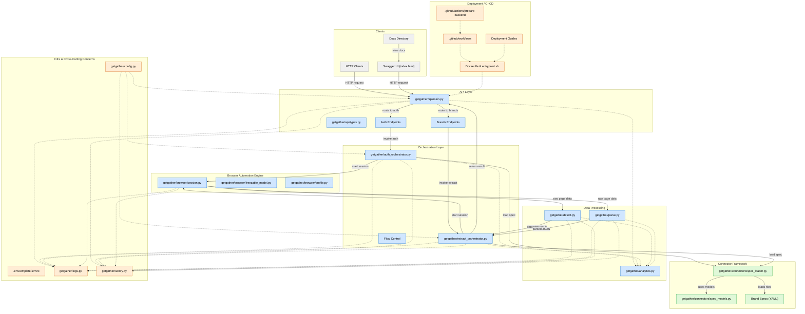

```mermaid
flowchart TD
    %% Clients Layer
    subgraph "Clients"
        Docs["Docs Directory"]:::external
        HTTPClients["HTTP Clients"]:::external
        APIFrontend["Swagger UI (index.html)"]:::external
    end

    %% API Layer
    subgraph "API Layer"
        API_Main["getgather/api/main.py"]:::compute
        AuthEndpoints["Auth Endpoints"]:::compute
        BrandsEndpoints["Brands Endpoints"]:::compute
        SharedTypes["getgather/api/types.py"]:::compute
    end

    %% Orchestration Layer
    subgraph "Orchestration Layer"
        AuthOrch["getgather/auth_orchestrator.py"]:::compute
        ExtractOrch["getgather/extract_orchestrator.py"]:::compute
        Flow["Flow Control"]:::compute
    end

    %% Connector Framework
    subgraph "Connector Framework"
        SpecLoader["getgather/connectors/spec_loader.py"]:::data
        SpecModels["getgather/connectors/spec_models.py"]:::data
        BrandSpecs["Brand Specs (YAML)"]:::data
    end

    %% Browser Automation Engine
    subgraph "Browser Automation Engine"
        Session["getgather/browser/session.py"]:::compute
        Freezable["getgather/browser/freezable_model.py"]:::compute
        Profile["getgather/browser/profile.py"]:::compute
    end

    %% Data Processing
    subgraph "Data Processing"
        Detect["getgather/detect.py"]:::compute
        Parse["getgather/parse.py"]:::compute
        Analytics["getgather/analytics.py"]:::compute
    end

    %% Infrastructure & Cross-Cutting Concerns
    subgraph "Infra & Cross-Cutting Concerns"
        Config["getgather/config.py"]:::infra
        Env[".env.template/.envrc"]:::infra
        Logs["getgather/logs.py"]:::infra
        Sentry["getgather/sentry.py"]:::infra
    end

    %% Deployment / CI-CD
    subgraph "Deployment / CI-CD"
        Docker["Dockerfile & entrypoint.sh"]:::infra
        GHWorkflows[".github/workflows"]:::infra
        GHActions[".github/actions/prepare-backend"]:::infra
        DeployDocs["Deployment Guides"]:::infra
    end

    %% Data Flow
    HTTPClients -->|"HTTP request"| API_Main
    Docs -->|"view docs"| APIFrontend
    APIFrontend -->|"HTTP request"| API_Main
    API_Main -->|"route to auth"| AuthEndpoints
    API_Main -->|"route to brands"| BrandsEndpoints
    AuthEndpoints -->|"invoke auth"| AuthOrch
    BrandsEndpoints -->|"invoke extract"| ExtractOrch
    AuthOrch -->|"load spec"| SpecLoader
    ExtractOrch -->|"load spec"| SpecLoader
    SpecLoader -->|"uses models"| SpecModels
    SpecLoader -->|"loads files"| BrandSpecs
    AuthOrch -->|"start session"| Session
    ExtractOrch -->|"start session"| Session
    Session -->|"raw page data"| Detect
    Session -->|"raw page data"| Parse
    Detect -->|"detection result"| ExtractOrch
    Parse -->|"parsed JSON"| ExtractOrch
    ExtractOrch -->|"return result"| API_Main

    %% Cross-cutting
    API_Main -.-> Logs
    AuthOrch -.-> Logs
    ExtractOrch -.-> Logs
    Session -.-> Logs
    Detect -.-> Logs
    Parse -.-> Logs

    API_Main -.-> Sentry
    AuthOrch -.-> Sentry
    ExtractOrch -.-> Sentry
    Session -.-> Sentry
    Detect -.-> Sentry
    Parse -.-> Sentry

    API_Main -.-> Analytics
    AuthOrch -.-> Analytics
    ExtractOrch -.-> Analytics
    Detect -.-> Analytics
    Parse -.-> Analytics

    Config -.-> API_Main
    Config -.-> AuthOrch
    Config -.-> ExtractOrch

    %% Deployment Connections
    Docker -.-> API_Main
    GHWorkflows -.-> Docker
    GHActions -.-> GHWorkflows
    DeployDocs -.-> Docker

    %% Click Events
    click Docs "https://github.com/getgather-hub/getgather/tree/main//docs"
    click HTTPClients "https://github.com/getgather-hub/getgather/tree/main//docs"
    click APIFrontend "https://github.com/getgather-hub/getgather/blob/main/getgather/api/frontend/index.html"
    click API_Main "https://github.com/getgather-hub/getgather/blob/main/getgather/api/main.py"
    click AuthEndpoints "https://github.com/getgather-hub/getgather/blob/main/getgather/api/routes/auth/endpoints.py"
    click BrandsEndpoints "https://github.com/getgather-hub/getgather/blob/main/getgather/api/routes/brands/endpoints.py"
    click SharedTypes "https://github.com/getgather-hub/getgather/blob/main/getgather/api/types.py"
    click AuthOrch "https://github.com/getgather-hub/getgather/blob/main/getgather/auth_orchestrator.py"
    click ExtractOrch "https://github.com/getgather-hub/getgather/blob/main/getgather/extract_orchestrator.py"
    click Flow "https://github.com/getgather-hub/getgather/blob/main/getgather/flow.py"
    click SpecLoader "https://github.com/getgather-hub/getgather/blob/main/getgather/connectors/spec_loader.py"
    click SpecModels "https://github.com/getgather-hub/getgather/blob/main/getgather/connectors/spec_models.py"
    click BrandSpecs "https://github.com/getgather-hub/getgather/tree/main/getgather/connectors/brand_specs/"
    click Session "https://github.com/getgather-hub/getgather/blob/main/getgather/browser/session.py"
    click Freezable "https://github.com/getgather-hub/getgather/blob/main/getgather/browser/freezable_model.py"
    click Profile "https://github.com/getgather-hub/getgather/blob/main/getgather/browser/profile.py"
    click Detect "https://github.com/getgather-hub/getgather/blob/main/getgather/detect.py"
    click Parse "https://github.com/getgather-hub/getgather/blob/main/getgather/parse.py"
    click Analytics "https://github.com/getgather-hub/getgather/blob/main/getgather/analytics.py"
    click Config "https://github.com/getgather-hub/getgather/blob/main/getgather/config.py"
    click Env "https://github.com/getgather-hub/getgather/blob/main/.env.template"
    click Logs "https://github.com/getgather-hub/getgather/blob/main/getgather/logs.py"
    click Sentry "https://github.com/getgather-hub/getgather/blob/main/getgather/sentry.py"
    click Docker "https://github.com/getgather-hub/getgather/tree/main/Dockerfile"
    click GHWorkflows "https://github.com/getgather-hub/getgather/blob/main/.github/workflows/container.yml"
    click GHActions "https://github.com/getgather-hub/getgather/blob/main/.github/actions/prepare-backend/action.yaml"
    click DeployDocs "https://github.com/getgather-hub/getgather/blob/main/docs/deploy_fly.md"

    %% Styles
    classDef compute fill:#D0E6FF,stroke:#0366d6,color:#000;
    classDef data fill:#E0F8D8,stroke:#28a745,color:#000;
    classDef infra fill:#FFEDD5,stroke:#d15704,color:#000;
    classDef external fill:#F0F0F0,stroke:#999,color:#000;
```
